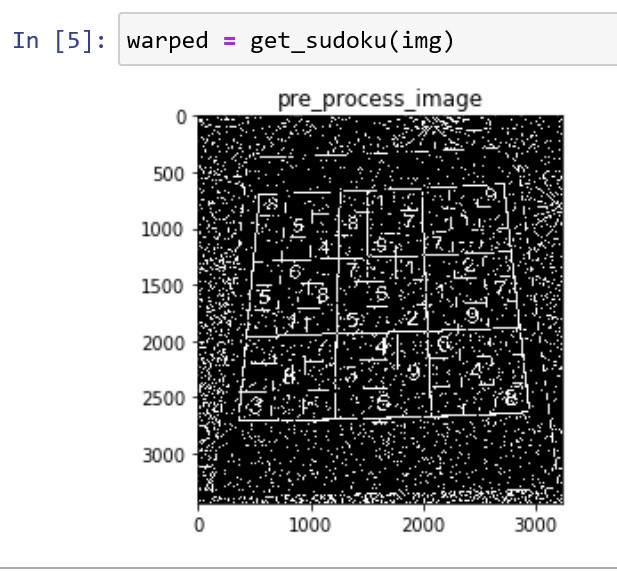
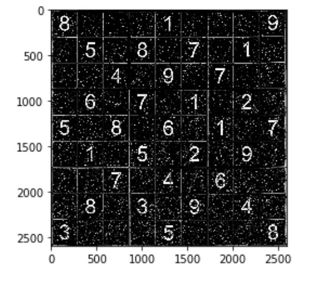
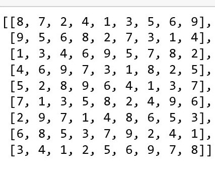

# Sudoku_Solver

Solving sudoku has been a very old thing. Here is the new way to solve sudoku.
How about taking a snapshot and getting a solved one.
This is the place where we sovle sudoku using its image.

# Step1. Extracting sudoku from image.
	1. Preprocessing involves 
		Gaussian Blurr
		Adaptive Thresholding
		Grayscale
	2. Find Largest Polygon (Contour).
	3. Crop and warp.
		get perspective transform.
		warp perspective transform.
		remove gridlines.

# Step2. Extract each number and make a digital sudoku
	1. crop image into 81 grids.
	2. preprocess individual image.
	3. apply morphology to sharp boundary and remove inside noise.
	4. Feed the image in the trained model to get matrix.

	

# Step3. Solve sudoku 
	Use standard backtraking technique.

Key Task: Finding empty spaces

__Approach1 :__ Include empty spaces(noisy and preprocessed both) in your dataset with label '0'. It will require lot of mannual work.

__Approach2 :__ Detection of countour in cropped image of each digits before feeding into the model. If contour is smaller than a given threshold then it is considered as empty space.

__Approach3 :__ Use the on-hot-encoding advantage in the CNN model.If the confidence in the final array is smaller than a given threshold then take it as empty space.
